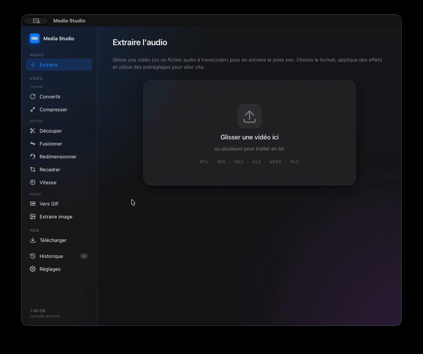

# Media Studio

> Suite multi-outils audio et vidéo pour macOS. 10 outils, tout en local, sans cloud.

<p align="center">
  
</p>

## Ce que ça fait

**Audio**
- **Extraire l'audio** : MP3, AAC ou WAV avec trim, normalisation EBU R128, fondus, pochette, tags ID3, traitement par lot et préréglages éditables.

**Vidéo, Format**
- **Convertir** : MP4, MOV, MKV, WEBM, codec H.264, H.265, AV1 ou copie.
- **Compresser** : bitrate cible explicite, presets en un clic (Discord, WhatsApp, Discord Nitro, iPhone, Web HD).

**Vidéo, Édition**
- **Découper** : sans ré-encodage (instantané), timeline avec frise de vignettes générée par ffmpeg.
- **Fusionner** : concat de plusieurs vidéos sans ré-encodage.
- **Redimensionner et Pivoter** : rotation pixel-perfect (90, 180, 270) + flip horizontal/vertical, aperçu CSS live.
- **Recadrer** : overlay visuel avec 8 poignées, ratios préset (16:9, 9:16, 1:1, 4:5, 4:3), lecteur vidéo custom.
- **Vitesse** : slow-mo ou fast-forward de 0.25× à 4×, pitch audio préservé.

**Vidéo, Image**
- **Vers GIF** : pipeline 2-pass haute qualité (palette dédiée), fps, résolution et extrait réglables.
- **Extraire image** : capture multiple en PNG ou JPG à des instants précis.

**Web**
- **Télécharger** : via yt-dlp en sidecar. Compatible YouTube, TikTok, Twitter, Instagram, Vimeo et beaucoup d'autres. Vidéo jusqu'à 4K ou audio extrait.

## Stack technique

- **Frontend** : Vite + React 18 + TypeScript (strict).
- **Backend** : Rust ([Tauri v2](https://tauri.app)).
- **Media** : [ffmpeg 8.1](https://ffmpeg.org) et [yt-dlp](https://github.com/yt-dlp/yt-dlp) en sidecars.
- **Plugins Tauri** : shell, dialog.
- **Cible** : macOS arm64 ou x86_64.

## Setup

```bash
# 1. Cloner le repo
git clone https://github.com/anisselbd/media-studio-mac.git
cd media-studio-mac

# 2. Télécharger les binaires sidecar (ffmpeg + yt-dlp, ~120 Mo)
./setup.sh

# 3. Installer les deps front
npm install

# 4. Lancer en dev
npm run tauri dev
```

## Build release

```bash
npm run tauri build
# Sortie : src-tauri/target/release/bundle/macos/Media Studio.app
```

## Architecture

```
src/
├── App.tsx           # Shell + Extraire audio + History + Presets + Settings
├── VideoViews.tsx    # 9 vues vidéo + DownloadView (yt-dlp)
└── styles.css        # Design Apple-like (glassmorphism, dark mode)

src-tauri/
├── src/lib.rs        # Toutes les commandes Tauri (ffmpeg + yt-dlp)
└── binaries/         # Sidecars (gitignored, voir setup.sh)
```

## Générer ton propre GIF de démo

Le GIF affiché en haut de ce README est lui-même produit avec Media Studio.

1. `Cmd+Shift+5` sur macOS pour enregistrer une partie de l'écran en `.mov`.
2. Drag le fichier dans **Vers GIF**.
3. Régler : 15 fps, 720p, découper l'extrait pertinent.
4. Récupérer le `.gif` et le placer dans `docs/screenshots/demo.gif`.

## Licence

Usage personnel. Les binaires sidecar ont leurs propres licences :
- ffmpeg : LGPL ou GPL selon les modules.
- yt-dlp : Unlicense (domaine public).
